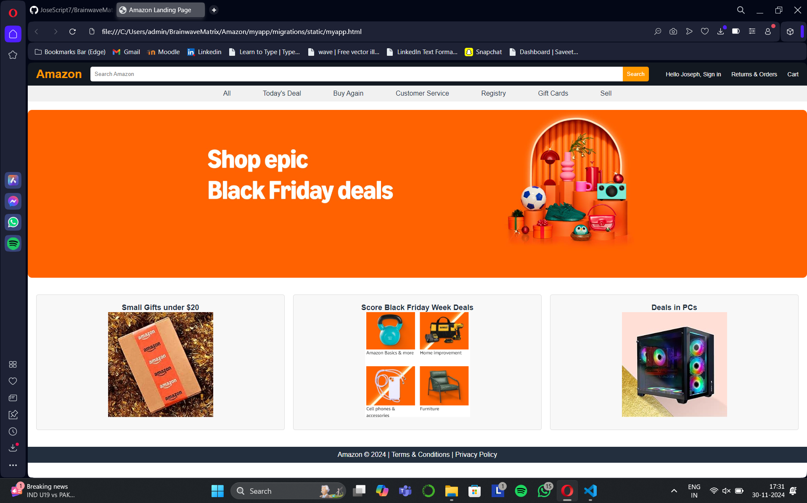

# Brainwave Matrix Solution
# Web Development Internship Task-1
# To create landing page of any website you like
## Date:30.11.2024

## AIM:
To create a visually stunning and fully responsive landing page for the Amazon website using HTML and CSS.

## DESIGN STEPS:

## Step 1:
Initialize a new Django project for managing the application.

## Step 2:
Create a dedicated app within the Django interface.

## Step 3:
Set up a folder named static in the app directory to hold all the required files.

## Step 4:
Create a new HTML file inside the static folder for the landing page.

## Step 5:
Write the HTML structure, ensuring semantic tags and clean coding practices.

## Step 6:
Design a visually appealing layout by incorporating relevant CSS properties like flexbox, grid, and hover effects.

## Step 7:
Choose a suitable color palette and style scheme to match Amazon's branding.

## Step 8:
Add images (like banners, categories) in their designated sections for a professional look.

## Step 9:
Test and launch the page locally using the Django server.

## PROGRAM:
myapp.html

```
<!DOCTYPE html>
<html lang="en">
    <head>
        <meta charset="UTF-8">
        <meta name="viewport" content="width=device-width, initial-scale=1.0">
        <title>Amazon Landing Page</title>
        <link rel="stylesheet" href="styles.css">
    </head>
    <body>
        <header class="header">
            <div class="logo">
                <h1>Amazon</h1>
            </div>
            <div class="search-bar">
                <input type="text" placeholder="Search Amazon">
                <button>Search</button>
            </div>
            <div class="account">
                <span>Hello Joseph, Sign in</span>
                <span>Returns & Orders</span>
                <span>Cart</span>
            </div>
        </header>

        <div class="nav-container">
            <nav class="nav-menu">
                <ul>
                    <li>All</li>
                    <li>Today's Deal</li>
                    <li>Buy Again</li>
                    <li>Customer Service</li>
                    <li>Registry</li>
                    <li>Gift Cards</li>
                    <li>Sell</li>
                </ul>
            </nav>
        </div>

        <main>
            <section class="hero">
                <div class="banner">
                    
                </div>
            </section>

            <section class="categories">
                <div class="category">
                    <h3>Small Gifts under $20</h3>
                    
                </div>
                <div class="category">
                    <h3>Score Black Friday Week Deals</h3>
                    
                </div>
                <div class="category">
                    <h3>Deals in PCs</h3>
                    
                </div>
            </section>
        </main>

        <footer class="footer">
            <p>Amazon © 2024 | Terms & Conditions | Privacy Policy</p>
        </footer>
    </body>
</html>
```

styles.css
```
* {
    margin: 0;
    padding: 0;
    box-sizing: border-box;
    font-family: Arial, sans-serif;
}

body {
    background-color: #fff;
    color: #232f3e;
}

.header {
    display: flex;
    justify-content: space-between;
    align-items: center;
    padding: 10px 20px;
    background-color: #131921;
    color: white;
}

.header .logo h1 {
    color: #ff9900;
    font-size: 28px;
}

.header .search-bar {
    flex: 1;
    display: flex;
    margin: 0 20px;
}

.header .search-bar input {
    flex: 1;
    padding: 10px;
    border: none;
    border-radius: 5px 0 0 5px;
}

.header .search-bar button {
    padding: 10px;
    background-color: #ff9900;
    border: none;
    border-radius: 0 5px 5px 0;
    color: white;
    cursor: pointer;
}

.header .account span {
    margin-left: 20px;
    font-size: 14px;
}

.nav-container {
    background-color: #f1f1f1;
    padding: 10px 0;
}

.nav-menu ul {
    display: flex;
    justify-content: space-around;
    list-style: none;
    margin: 0 auto;
    max-width: 1000px;
}

.nav-menu ul li {
    font-size: 16px;
    color: #232f3e;
    cursor: pointer;
}

.hero {
    width: 100%;
    height: 400px;
    margin: 20px 0;
    border-radius: 10px;
    overflow: hidden;
}

.hero img {
    width: 100%;
    height: 100%;
    object-fit: cover;
}

.categories {
    display: grid;
    grid-template-columns: repeat(auto-fit, minmax(350px, 1fr));
    gap: 20px;
    padding: 20px;
    text-align: center;
}

.category {
    background-color: #f8f8f8;
    border: 1px solid #ddd;
    border-radius: 5px;
    padding: 20px;
    display: flex;
    flex-direction: column;
    align-items: center;
    justify-content: center;
}

.category img {
    width: 250px;
    height: 250px;
    object-fit: cover;
    margin-bottom: 10px;
}

.category h3 {
    font-size: 18px;
    color: #232f3e;
    text-align: center;
}

.footer {
    background-color: #232f3e;
    color: white;
    text-align: center;
    padding: 10px;
    margin-top: 20px;
}
```

## OUTPUT:
Reference image used:


Output:


## RESULT:
The landing page for Amazon was successfully designed with a sleek, responsive interface using HTML and CSS, fulfilling the task requirements
